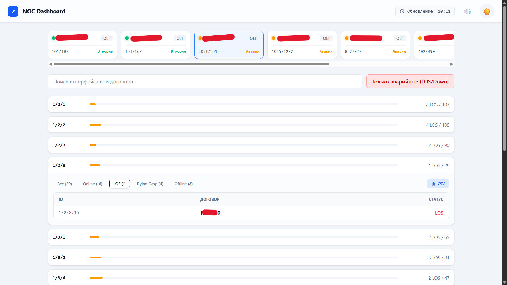
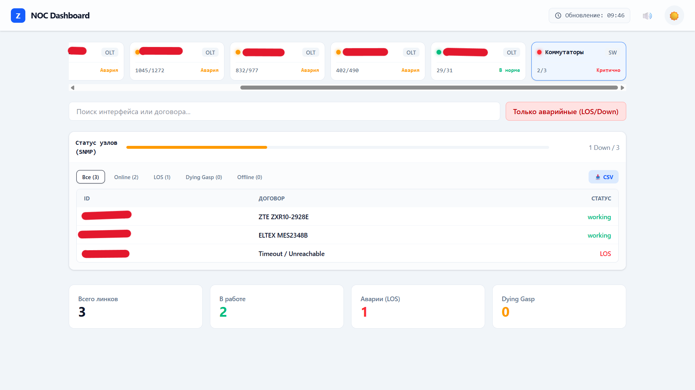

# noc-monitor

**noc-monitor** — fullstack-система мониторинга абонентского оборудования в реальном времени. Объединяет опрос GPON OLT (ZTE) через Telnet и мониторинг коммутаторов доступа через SNMPv2 в единый интерактивный веб-интерфейс.

[](https://github.com/ZephronixQ/noc-monitor/releases)
[](https://www.python.org/)
[](https://fastapi.tiangolo.com/)
[](https://svelte.dev/)
[](https://www.docker.com/)
[](LICENSE)
[](https://en.wikipedia.org/wiki/Simple_Network_Management_Protocol)
[](https://github.com/ZephronixQ/noc-monitor)

---

## Возможности

- **GPON мониторинг** — отслеживание статусов ONU (LOS, DyingGasp, Offline) с автоматическим получением описаний для проблемных портов.
- **Switch мониторинг** — проверка доступности коммутаторов разных вендоров через SNMP.
- **Real-time дашборд** — автообновление данных через WebSocket без перезагрузки страницы.
- **Экспорт CSV** — выгрузка состояния любого порта в один клик.

---

## Поддерживаемое оборудование

**GPON OLT:**
- ZTE ZXA10 C300, C320

**Коммутаторы (SNMPv2):**
- ZTE ZXR10, SNR S2965/S2985/S2990, D-Link DES/DGS, Eltex MES

---

## Скриншоты
 
**GPON мониторинг — статусы ONU по портам OLT**

 
**Switch мониторинг — статус узловых коммутаторов через SNMP**


---

## Конфигурация

Перед запуском создайте файл `backend/config/inventory.py` на основе шаблона — укажите адреса устройств, учётные данные и SNMP community.

> ⚠️ Файл с реальными данными добавлен в `.gitignore` и не публикуется в репозитории.

| Файл | Что содержит |
|---|---|
| `backend/config/inventory.py` | Списки `OLT_LIST`, `SWITCH_LIST`, учётные данные, SNMP community |
| `backend/config/settings.py` | Интервал опроса (`POLL_INTERVAL_SEC`), число потоков (`MAX_WORKERS`), OID, паттерны вендоров |

---

## Запуск

```bash
git clone https://github.com/ZephronixQ/noc-monitor.git
cd noc-monitor
docker compose up --build
```

> Требуется установленный [Docker](https://docs.docker.com/get-docker/).  
> Интерфейс доступен по адресу: `http://localhost:5173`

Предпочитаете ручной запуск без Docker? → 📄 [docs/manual-setup.md](docs/manual-setup.md)

## Лицензия

См. файл [LICENSE](LICENSE) для информации о лицензии.

## Вклад

Прочитайте [CONTRIBUTING.md](CONTRIBUTING.md) для информации о том, как внести вклад в проект.

## Журнал изменений

См. файл [CHANGELOG.md](docs/CHANGELOG.md) для истории изменений.

## Список задач

См. файл [TODO.md](docs/TODO.md) для текущих задач и планов развития.

## Кодекс поведения

Участвуя в проекте, вы соглашаетесь соблюдать наш [кодекс поведения](CODE_OF_CONDUCT.md).
